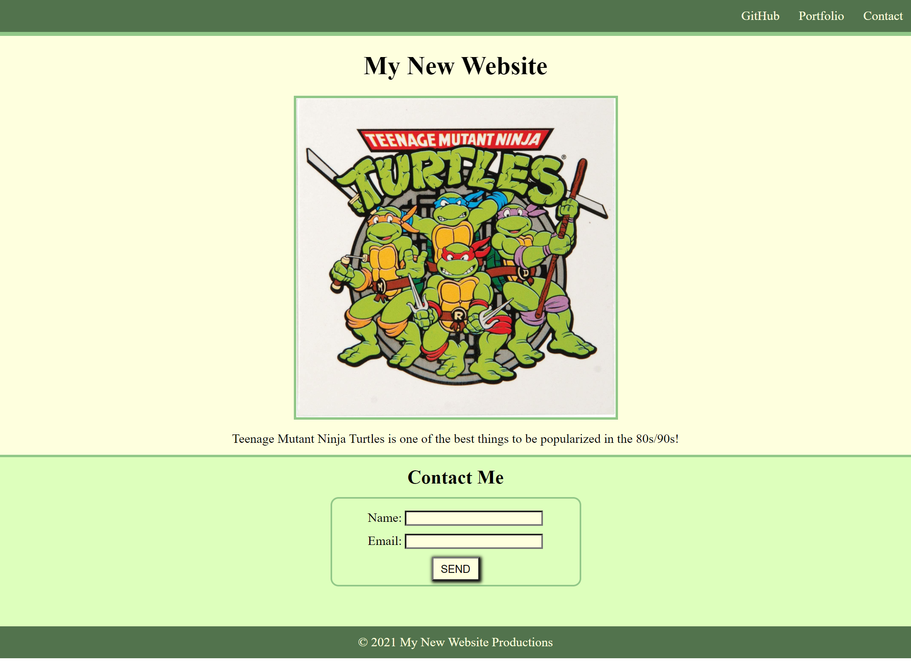

# 01-miniProject-practiceWebsite

## Description
- We did this project in class on the last day of the first week. I definitely struggled at first, but with practice I greatly improved my HTML and CSS skills.
- I learned a lot about borders, display, forms, and adjusting the margins, padding, and line-heights of page elements to turn the page into a more cohesive unit.

## Credits
- Color palette taken from colorhunt.co; it is color palette #264587.

## Screenshot:

## Deployed Site:
[Link to live site.](https://mmonyok.github.io/01-miniProject-practiceWebsite/)
